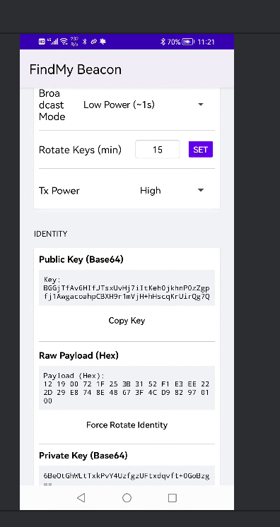

# 🏷️ nRF5-AirTag-Toolkit

> **打造属于你自己的 AirTag —— 基于 Apple Find My 网络的极致开源工具箱**
>
> *让每一块 nRF5 芯片都能被全世界的 iPhone 守护。*


---

## 📖 简介 (Introduction)

**nRF5-AirTag-Toolkit** 是目前最完善、最“保姆级”的第三方 Find My 网络固件部署方案。

它是为了解决开源社区中“刷机难、配置烦、密钥乱”的痛点而诞生的。无论你是拥有 **J-Link** 还是廉价的 **ST-Link**，无论你是资深嵌入式工程师还是没有任何代码基础的小白，这个工具箱都能让你在 5 分钟内点亮你的设备。

### ✨ 核心特性 (Features)

* **⚡️ 极速自动化 (Zero-Friction Flashing)**
  * 告别复杂的命令行，一个脚本搞定编译、打补丁、烧录全流程。
  * 自动识别芯片型号，自动处理 SoftDevice 协议栈合并。
* **🔑 智能密钥管理 (Smart Key Injection)**
  * **独家功能**：解决批量刷写时 MAC 地址和密钥重复的顽疾。
  * 脚本自动为每一台设备生成独一无二的 `.key` 文件并注入固件，真正的量产级体验。
* **🛡️ 救砖黑科技 (Anti-Brick Guard)**
  * 内置芯片解锁机制，自动检测并移除 Read Protection。
  * 提供 J-Flash 图形化救砖指南，专治各种“疑难杂症”。
* **🔌 全平台调试器支持**
  * **J-Link**: 完美支持，速度最快，功能最全。
  * **ST-Link**: 通过 OpenOCD 深度适配，几块钱的调试器也能玩转 nRF52。

---

## 🚀 快速开始 (Quick Start)

我们为不同基础的用户准备了不同的入口：

### 👶 我是小白 (Beginner)

只有一块板子，不懂代码，只想刷进去能用。

* 如果你有 J-Link: 👉 [**nRF52832 保姆级教程 (J-Link 版)**](docs/10-nRF52832刷机保姆级教程.md)
* 如果你有 ST-Link: 👉 [**nRF52832 保姆级教程 (ST-Link 版)**](docs/11-nRF52832_STLink刷机保姆级教程.md)

### 🧑‍💻 我是开发者 (Developer)

我想修改广播间隔、调整发射功率，或者批量生产。

* 查看 [**完整文档导航**](docs/README-文档导航.md)
* 或者直接运行我们的自动化脚本：

    ```bash
    # 适用于 nRF52832 + J-Link
    ./n52832autoflash_jlink.sh
    
    # 适用于 nRF52832 + ST-Link
    ./n52832autoflash_stlink.sh
    ```

---

## 🗺️ 未来路线图 (Roadmap)

我们正在构建更宏大的未来，让 Find My 开发变得像安装 App 一样简单。

* [ ] **🖥️ 跨平台 GUI 客户端**
  * 开发基于 Electron/Flutter 的桌面端程序。
  * **小白模式**: 鼠标点一点，固件自动刷进去，无需接触终端。
  * **可视化配置**: 拖拽修改广播频率、电池曲线。
  
  <p align="center"></p>

* [ ] **🪟 Windows 平台原生支持**
  * 当前脚本基于 Bash (macOS/Linux)。
  * 未来将移植 PowerShell 版本，让 Windows 用户不仅能在 WSL 里跑，还能直接原生运行。

* [ ] **♾️ 全系 nRF 芯片支持**
  * [x] nRF52810 (已支持)
  * [x] nRF52832 (已支持)
  * [ ] **nRF52840**: 支持 USB Dongle 形态。
  * [ ] **nRF51822**: 复活吃灰的老古董芯片 (开发中)。

---

## 📂 目录结构

```text
.
├── config/                 # [隐私] 存放生成的专属密钥和日志 (Git已忽略)
├── docs/                   # 📚 价值百万的文档库
├── heystack-nrf5x/         # 核心固件源码 (基于 OpenHaystack)
├── n52832autoflash_*.sh    # ⚡️ 自动化刷机脚本
├── scripts/                # 辅助工具脚本
└── README.md
```

---

## 🤝 致谢 (Acknowledgements)

本项目核心固件基于优秀的开源项目二次开发，特此感谢：

* **[heystack-nrf5x](https://github.com/pix/heystack-nrf5x)**: 本项目的固件核心，基于 acalatrava 的工作进行了 nRF5 适配。
* **[OpenHaystack](https://github.com/seemoo-lab/openhaystack)**: 逆向工程 Find My 网络的先驱，没有他们就没有这一切。

---

## ⚠️ 免责声明

本项目仅供教育和研究使用。

* 请勿将本项目用于非法追踪他人。
* AirTag 和 Find My 是 Apple Inc. 的商标。
* 本项目与 Apple Inc. 无任何关联。

---

*Made with ❤️ by Open Source Community*
