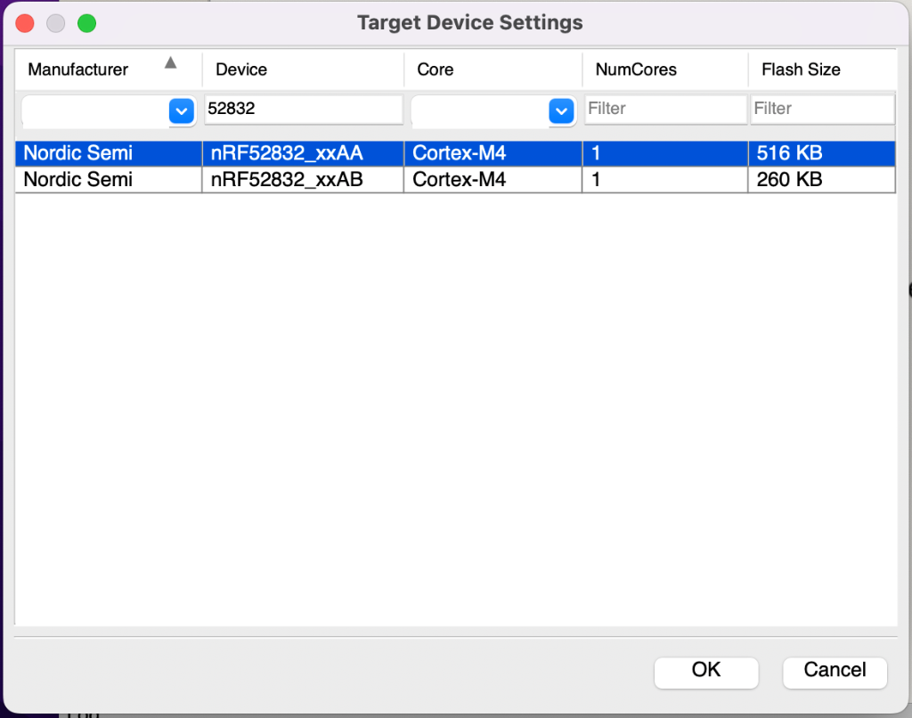
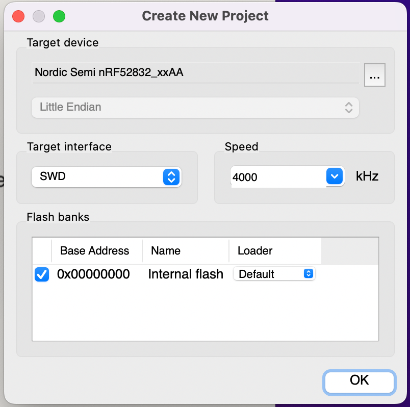
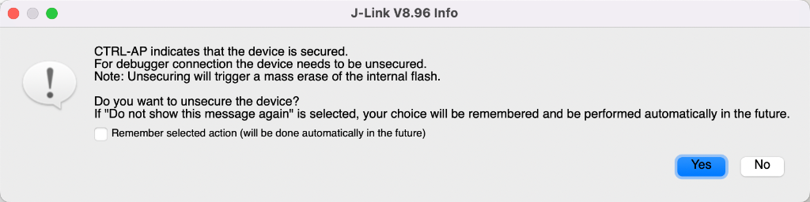
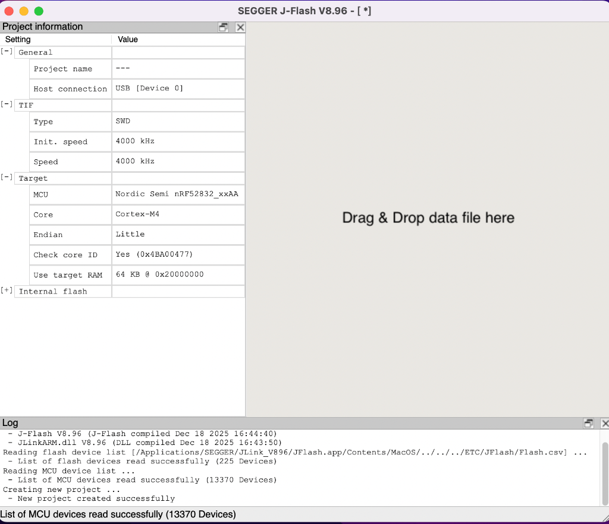
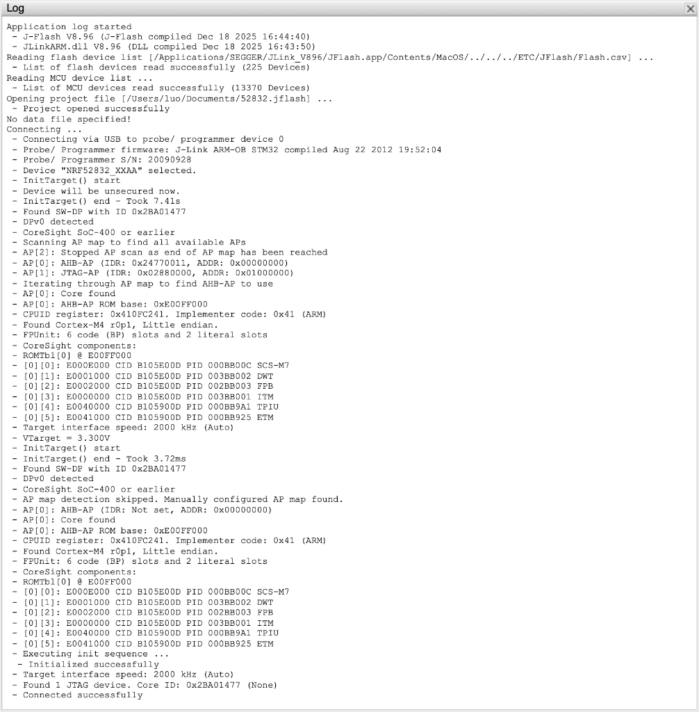

# nRF52 芯片救砖指南 (J-Flash 图形化界面版)

当所有的脚本都失效，提示 `CTRL-AP indicates that the device is secured` 时，这是终极解决方案。
本指南将教你如何使用 Segger 官方的 **J-Flash** 软件（包含在 J-Link 驱动包中）来手动解除芯片保护。

## 🛠 准备工作

1. 确保已安装 **J-Link Software and Documentation Pack** (macOS 版)。
2. 在启动台 (Launchpad) 或应用程序文件夹中找到 **J-Flash** (不是 J-Flash Lite)。
3. 连接好 J-Link 和目标芯片。

---

## 第一步：新建项目

打开 J-Flash，你会看到欢迎界面。

1. 选择 **Create new project** (新建项目)。
2. 点击 **Start J-Flash**。

---

## 第二步：配置芯片型号

这一步非常关键，选错型号可能导致连接失败。

1. 在弹出的设备选择中，点击 `...` 按钮浏览设备列表。
2. 输入 `52832` 筛选。
3. 选择 **nRF52832_xxAA**。
4. 接口 (Target interface) 选择 **SWD**。
5. 速度 (Speed) 推荐 **4000 kHz** (如果连接不稳定可降到 1000)。
6. 点击 **OK**。

---

## 第三步：连接并解锁

这是见证奇迹的时刻。

1. 在主界面，点击菜单栏的 **Target** -> **Connect**。
2. **如果芯片被锁**，J-Flash 会立刻弹出一个警告窗口 (如下图)。
    * 提示: `CTRL-AP indicates that the device is secured.` (CTRL-AP 显示设备已加密)
    * 询问: `Do you want to unsecure the device?` (你想解密设备吗？)
3. **毫不犹豫地点击 `Yes`**。

---

## 第四步：等待擦除完成

点击 Yes 后，J-Link 会执行 "Mass Erase" (全片擦除)。

* 这会清除芯片内所有的旧固件和保护位。
* 等待几秒钟，直到下方日志显示连接成功。

当你看到日志中出现类似 `List of MCU devices read successfully` 或 `Connected successfully` 时，恭喜你，救砖成功！

完整的成功日志如下所示：

现在，你可以关闭 J-Flash，回到我们的自动化脚本 (`./n52832autoflash_jlink.sh`) 愉快地刷机了！🚀
