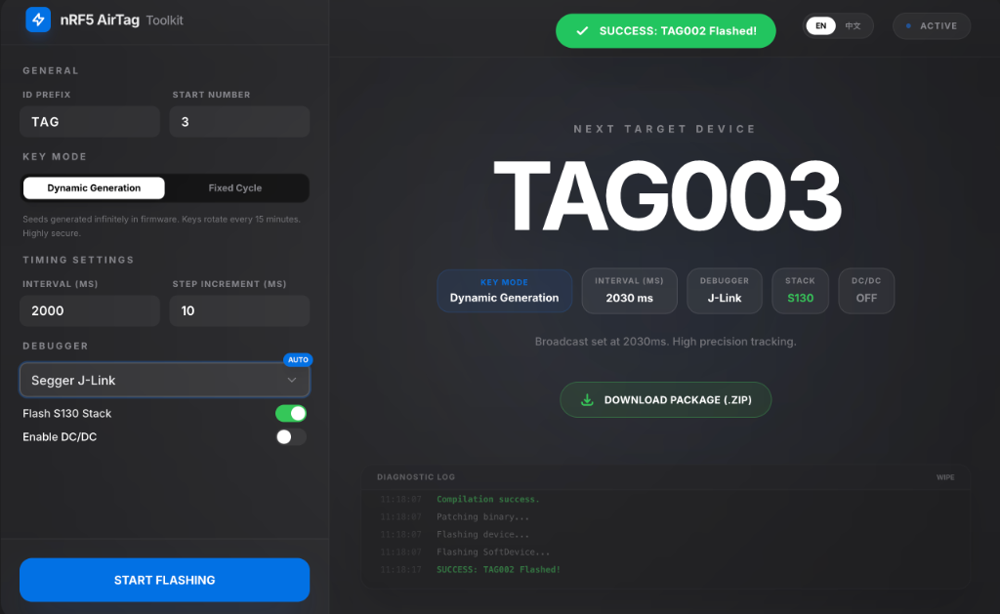
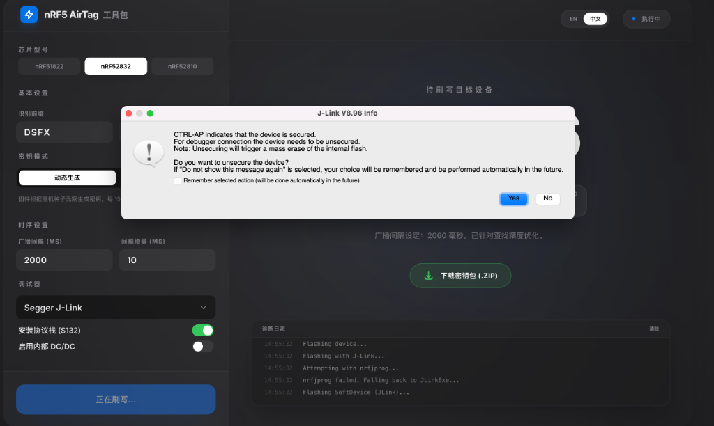
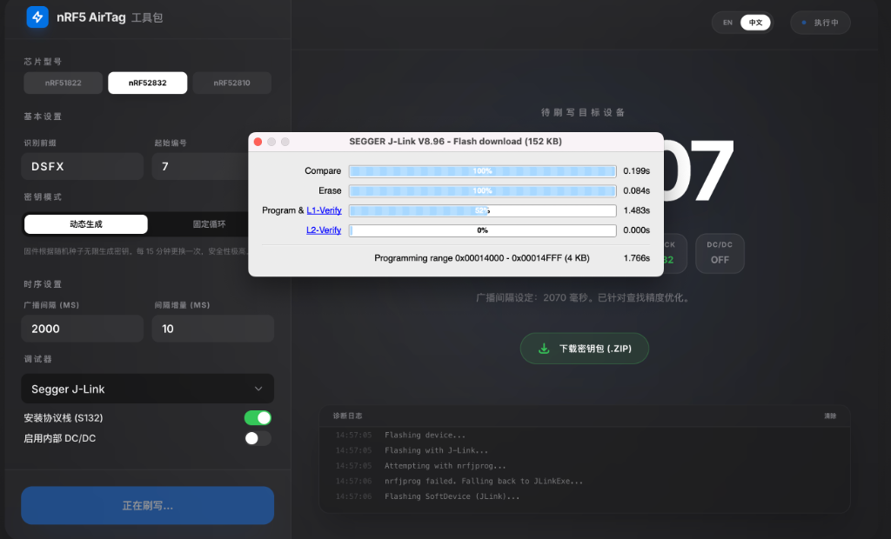

# nRF51822 统一刷写工具使用指南

本文档详细介绍了 `n51822_flash_tool.sh` 的使用方法。该工具集成了 J-Link 和 ST-Link 支持，并支持 Dynamic (动态密钥) 和 Static (静态密钥) 两种模式，旨在简化 nRF51822 设备的量产刷写流程。

## 1. 快速开始

### 方案 A：Web 控制台 (Studio 智控模式) - 推荐

这是一个具有极佳视觉体验和自动化逻辑的网页端工具，专门为高效生产设计。

1. 在终端中启动：

   ```bash
   python3 web_flash_tool.py
   ```

2. 在浏览器中打开：**[http://127.0.0.1:5001](http://127.0.0.1:5001)**

**特色：**

* **玻璃拟态设计**：极致的毛玻璃质感与动态背景。
* **紧凑布局**：针对 MacBook 屏幕深度优化，核心参数一眼全局，无需滚动。
* **智能交互**：刷写成功后顶部弹出成功通知，并自动增加编号预备下一台。
* **实时监测**：集成终端日志显示，随时掌握底层编译与刷写进度。

<p align="center"></p>

### 方案 B：终端脚本 (Terminal 模式)

适合在纯 Linux 环境或 SSH 远程操作。

```bash
./n51822_flash_tool.sh
```

---

## 2. 功能特性

1. **多调试器支持**：自动识别与适配 **J-Link** (推荐) 和 **ST-Link**。
2. **双密钥模式**：
    * **Dynamic Mode**: 无需 Keyfile，设备利用内部 Seed 滚动生成密钥。支持 **离线导出密钥** 用于追踪。
    * **Static Mode**: 使用固定的 Keyfile (`.keys`)。支持 **自动补全缺失的 Keyfile**。
3. **自动流水线**：
    * 自动编译固件。
    * 自动 Patch (注入) 密钥或 Seed。
    * 自动转换 Hex/Bin 格式并刷写。
    * 自动 ID 递增 (如 `MSF001` -> `MSF002`)。
4. **参数配置**：支持自定义广播间隔 (Advertising Interval) 和自动增量。

---

## 3. 详细操作流程

### 3.1 启动与初始配置

运行脚本后，你需要进行简单的初始化设置（支持默认值，直接回车即可）：

1. **选择模式**:
    * `1`: Dynamic Mode (默认)
    * `2`: Static Mode
2. **选择调试器**:
    * `1`: J-Link (默认)
    * `2`: ST-Link
3. **设备命名**:
    * 输入前缀 (如 `MSF`)
    * 输入起始编号 (如 `1`) -> 自动格式化为 `MSF001`
4. **广播参数**:
    * 基础间隔 (默认 `2000ms`)
    * 递增步长 (默认 `10ms`)
    * *示例*: 第一台 `2000ms`, 第二台 `2010ms`...

### 3.2 Dynamic Mode (动态密钥模式)

这是最简便的模式，适合快速批量测试。

1. **Seed 生成**: 每次刷写新设备时，工具会自动生成一个唯一的随机 Seed (32字节)。
2. **固件 Patch**: Seed 会被自动写入固件的特定区域。
3. **离线密钥导出 (追踪用)**:
    * 刷写开始前，系统会提示：`是否需要生成离线 Key 文件用于追踪? [Y/n]` (默认 Yes)。
    * **原理**: 调用 Python 脚本，根据刚刚生成的 Seed，在本地预先计算出未来的密钥列表（默认 200 个）。
    * **产物**: 生成 `config/DeviceName_devices.json`。
    * **用途**: 将此 JSON 文件导入到你的 Mac/Linux 追踪端程序中，即可追踪这台设备，无需等待设备广播出新 Public Key。

### 3.3 Static Mode (静态密钥模式)

适合需要严格管理 Keyfile 的场景。

1. **密钥检查**: 工具会自动在 `config/` 目录下查找名为 `前缀+编号_keyfile` 的文件 (如 `MSF001_keyfile`)。
2. **缺失自动处理**:
    * 如果文件不存在，工具会提示：`选择操作? (g=自动生成, m=手动路径, s=跳过, 默认g)`。
    * **自动生成 (g)**: 现场调用 Python 脚本生成一组符合 OpenHaystack 协议的密钥，并自动保存到 `config/` 目录。你也可以指定生成的密钥数量 (建议 <= 200)。
    * 这样你可以在空白环境下直接开始“刷写+生产 Key”，一气呵成。

---

## 4. 常见问题 (FAQ)

**Q: 为什么提示 Python 错误?**
A: 请确保安装了 `cryptography` 库：

```bash
pip3 install cryptography
```

**Q: 离线生成的 JSON 文件有什么用？**
A: OpenHaystack/FindMy 协议需要知道设备的 Public Key 才能追踪。

* 在 **Static Mode** 下，Public Key 是从 Keyfile 里读的。
* 在 **Dynamic Mode** 下，Public Key 是设备算出来的。如果不生成离线文件，你需要等设备广播出 Key 才能抓取。使用离线生成功能，你可以通过 Seed 提前算出设备未来所有的 Key，直接导入追踪程序即可“未卜先知”。

**Q: J-Link 无法连接?**
A:

1. 检查 SWD 线序 (SWDIO, SWCLK, GND, VCC)。
2. 脚本尝试了自动降速，但如果芯片被锁（读保护），尝试运行 `nrfjprog --recover` 解锁。

**Q: 遇到 "Device is secured" 提示怎么办？**

如果芯片被设置了读保护（常见于新出厂或从其他产品拆机的芯片），J-Link 官方软件连接时会弹出解锁提示：

<p align="center"></p>

此时请务必点击 **Yes**。工具会自动执行 **Mass Erase (全片擦除)**，解除保护状态。解除后即可正常刷写。

<p align="center"></p>

> **注意**：自动脚本中的 `nrfjprog --recover` 命令通常也能自动完成此解锁过程。如果脚本失败，请手动打开 J-Link Commander 或 J-Flash Lite 进行解锁。

**Q: ST-Link 无法连接?**
A: ST-Link 比较挑线和驱动。确保连接稳固。脚本中集成了 `nrf51 mass_erase` 尝试自动解锁。

---

## 5. 目录结构说明

* **`n51822_flash_tool.sh`**: 主程序脚本
* **`config/`**: 存放设备密钥 (`.keys`, `_keyfile`, `.json`)
* **`seeds/`**: Dynamic Mode 下生成的 Seed 备份 (`.hex`, `.bin`)
* **`heystack-nrf5x/tools/`**:
  * `generate_keys.py`: 用于 Static Mode 的密钥生成
  * `generate_keys_from_seed.py`: 用于 Dynamic Mode 的离线密钥计算
