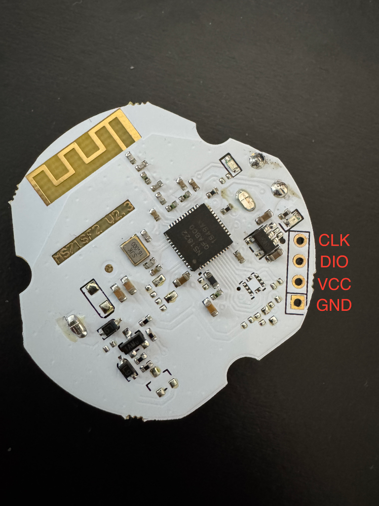
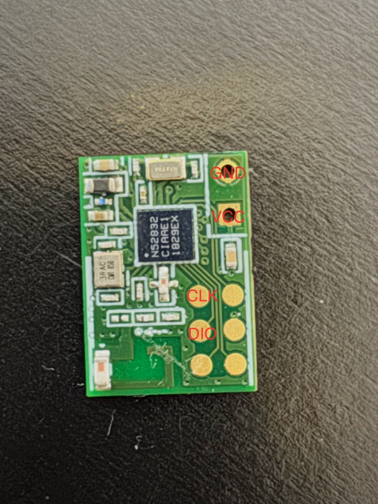
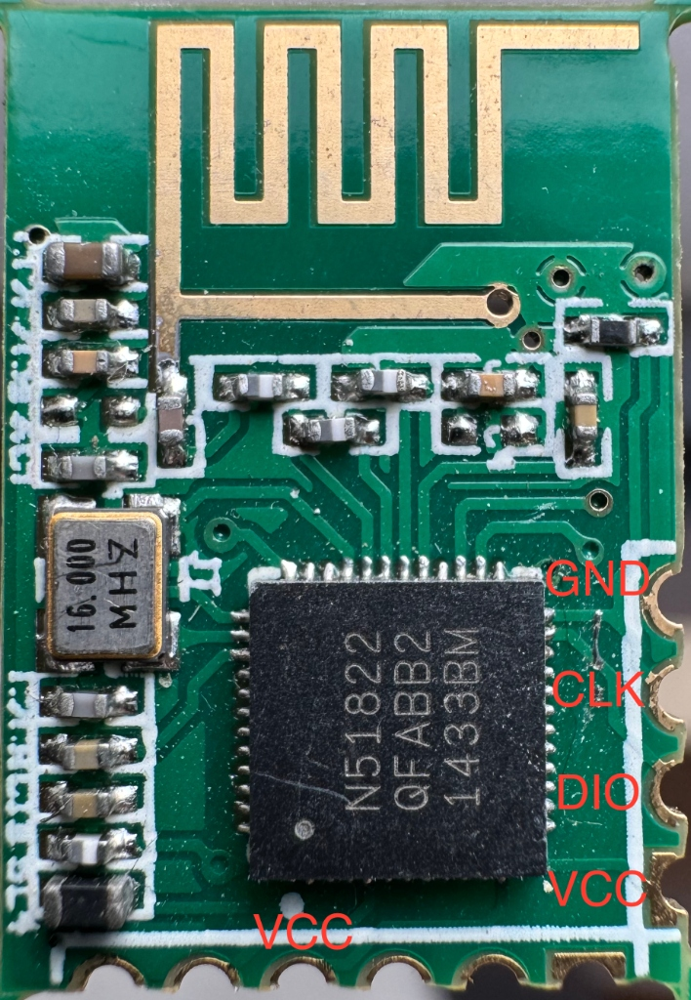
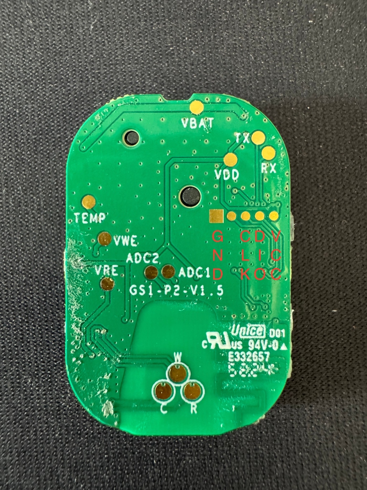

# 常见开发板接线图集 (Hardware Pinouts)

本文档旨在收集各类 nRF5x 开发板/模块的硬件接线定义，方便刷写时快速查找 SWD 接口。

---

## 1. 圆形防丢器模块 (nRF51822)

* **型号标识**: MS21SF2 V2.3
* **芯片**: nRF51822
* **特点**: 白色圆形 PCB。

### 接线定义

从侧边焊盘由上至下（参考图示）：

1. **CLK** (SWCLK)
2. **DIO** (SWDIO)
3. **VCC** (3.3V)
4. **GND**

> **注意**: 此板子通常从电池供电，VCC 焊盘可用于外部供电刷写（请勿同时连接 3V 电池和调试器电源，以免电压冲突）。

---

## 2. 绿色迷你模块 (nRF52832)

* **芯片**: nRF52832 (QFAA/CIAA)
* **特点**: 尺寸极小，常用于 DIY 集成。

### 接线定义

参考图示红字标注：

* **GND**: 顶部接地焊盘
* **VCC**: 3.3V 电源输入
* **CLK**: SWCLK (时钟线)
* **DIO**: SWDIO (数据线)

> **提示**: nRF52 系列刷写时推荐连接 VCC 以便 J-Link 检测目标电压 (VTref)。

---

## 3. 黑色圆形防丢器模块 (nRF52832)

* **型号标识**: nRF52832_A06
* **芯片**: nRF52832 (QFAA)
* **特点**: 黑色圆形 PCB，常见于薄款防丢器。

### 接线定义

参考图示红字标注：

* **DIO**: SWDIO (右侧靠上测试点)
* **CLK**: SWCLK (右侧靠下测试点)
* **GND/VCC**: 如果板上无明显焊盘，可能需要从电池座引出 (大面积金属通常为 GND)。

---

## 4. 绿色长条模块 (nRF51822)

* **芯片**: nRF51822 (QFAB)
* **特点**: 绿色长方形 PCB，边缘带半孔 (邮票孔)。

### 接线定义

参考图示红字标注（右侧由上至下）：

* **GND**: 接地
* **CLK**: SWCLK
* **DIO**: SWDIO
* **VCC**: 3.3V (侧边或底部均有 VCC 焊盘)

---

---

## 5. Unice 水滴形防丢器 (GS1-P2)

* **型号标识**: GS1-P2-V1.5 (Unice)
* **芯片**: nRF52832
* **特点**: 绿色水滴形 PCB，常见于 Unice 品牌防丢器。

### 接线定义

参考图示红字标注（从方形焊盘开始，从左向右）：

1. **GND**: 方形焊盘 (Ground)
2. **CLK**: SWDCLK (时钟线)
3. **DIO**: SWDIO (数据线)
4. **VCC**: 3.3V 电源焊盘

---

*(持续更新中，欢迎补充更多板型...)*
