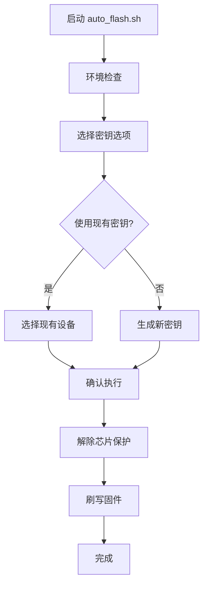

# 自动化刷写脚本使用说明

## 🚀 新增脚本：`scripts/auto_flash.sh`

这是一个完全自动化的刷写脚本，集成了密钥管理、芯片保护解除和固件刷写的完整流程。

## ✨ 功能特性

### 🔑 智能密钥管理
- **现有密钥选择**：列出并选择已有的密钥文件
- **新密钥生成**：直接调用 `generate_keys.py` 生成新密钥
- **自动文件管理**：自动复制密钥文件到 `config/` 目录

### 🛡️ 自动芯片保护解除
- **集成恢复脚本**：自动调用 `quick_chip_recovery.sh`
- **无需手动干预**：自动处理芯片保护问题

### 📱 固件刷写
- **增强的刷写脚本**：修改了 `compile_and_flash_2s.sh` 支持设备参数
- **自动密钥复制**：从 `config/` 目录自动复制密钥到编译目录

## 🎯 使用方法

### 基本用法
```bash
./scripts/auto_flash.sh
```

### 完整流程
1. **环境检查**：自动检查必要的工具和文件
2. **密钥选择**：选择现有密钥或生成新密钥
3. **芯片恢复**：自动解除芯片保护
4. **固件刷写**：编译并刷写固件

## 📋 操作流程示例

### 启动脚本
```bash
$ ./scripts/auto_flash.sh

🚀 nRF52810 自动化刷写工具
==========================

ℹ️  检查环境...
✅ 环境检查完成

ℹ️  现有密钥文件:
  📱 4P0EP4 (密钥数量: 200, 大小: 5.5K)
  📱 R0VVSW (密钥数量: 169, 大小: 4.6K)

请选择操作:
  1) 使用现有密钥
  2) 生成新密钥
  3) 退出
```

### 选择1：使用现有密钥
```bash
请选择 (1-3): 1

可用的密钥文件:
  - 4P0EP4
  - R0VVSW

请输入要使用的设备名称: R0VVSW
✅ 已选择设备: R0VVSW
```

### 选择2：生成新密钥
```bash
请选择 (1-3): 2

请输入新设备名称 (6位字符，如 DEV001): DEV001
请输入密钥数量 (默认 200): 200

ℹ️  为设备 DEV001 生成 200 个密钥...
ℹ️  正在生成密钥 (这可能需要一些时间)...
✅ 密钥生成完成
ℹ️  复制密钥文件到 config 目录...
✅ 密钥文件已复制到 config/DEV001_keyfile
✅ 设备 DEV001 密钥生成完成 (密钥数量: 200)
```

### 自动化执行
```bash
ℹ️  准备刷写设备: DEV001

是否继续执行芯片恢复和固件刷写? (Y/n): Y

🔄 开始自动化流程...
===================

📍 步骤 1/2: 解除芯片保护
ℹ️  开始解除芯片保护...
=== nRF52810 芯片保护快速恢复 ===
✅ 芯片保护解除成功

📍 步骤 2/2: 刷写固件
ℹ️  开始刷写固件...
=== nRF52810 固件编译和刷写 (2秒广播间隔) ===
📱 目标设备: DEV001
🔑 密钥文件: DEV001_keyfile
✅ 固件刷写成功

🎉 自动化刷写完成!
==================
✅ 设备 DEV001 已成功刷写
```

## 🔧 修改的脚本

### `scripts/compile_and_flash_2s.sh` 增强功能

#### 新增特性
- **设备名称参数**：支持 `./scripts/compile_and_flash_2s.sh [设备名称]`
- **智能密钥查找**：自动从 `config/` 目录查找并复制密钥文件
- **交互式设备选择**：如果未指定设备名称，显示可用设备列表

#### 使用方法
```bash
# 指定设备名称
./scripts/compile_and_flash_2s.sh DEV001

# 交互式选择
./scripts/compile_and_flash_2s.sh
```

## 📁 文件结构

### 生成的密钥文件
```
config/
├── DEV001_keyfile          # 二进制密钥文件 (用于刷写)
├── DEV001.keys             # 文本格式密钥 (用于查看)
└── DEV001_devices.json     # 设备配置文件 (用于 AirTag 应用)
```

### 密钥生成过程
1. 调用 `heystack-nrf5x/tools/generate_keys.py`
2. 生成文件到 `heystack-nrf5x/tools/keys/`
3. 自动重命名并复制到 `config/`
4. 清理临时输出目录

## 🛠️ 依赖要求

### 必需工具
- **Python3** + **cryptography** 库
- **nrfjprog** (Nordic 命令行工具)
- **openocd** (可选，备用恢复方法)
- **ARM GCC 工具链**

### 安装命令
```bash
# Python 依赖
pip3 install cryptography

# Nordic 工具
brew install --cask nordic-nrf-command-line-tools

# OpenOCD (可选)
brew install openocd

# ARM 工具链
brew install --cask gcc-arm-embedded
```

## 🔍 故障排除

### 常见问题

#### 1. 环境检查失败
```
❌ 缺少 Python cryptography 库
ℹ️  请运行: pip3 install cryptography
```
**解决方案**：安装缺失的依赖

#### 2. 密钥生成失败
```
❌ 密钥生成失败
```
**解决方案**：
- 检查 Python 环境
- 确保有足够的磁盘空间
- 检查 `heystack-nrf5x/tools/generate_keys.py` 文件是否存在

#### 3. 芯片保护解除失败
```
❌ 芯片保护解除失败
```
**解决方案**：
- 检查硬件连接
- 确保调试器正常工作
- 手动运行 `./scripts/quick_chip_recovery.sh`

#### 4. 固件刷写失败
```
❌ 固件刷写失败
```
**解决方案**：
- 确保芯片保护已解除
- 检查密钥文件是否正确
- 验证编译环境

## 🎯 最佳实践

### 1. 首次使用
- 确保所有依赖工具已安装
- 使用现有密钥进行测试
- 验证硬件连接

### 2. 批量操作
- 为每个设备生成唯一的密钥
- 使用有意义的设备名称 (如 DEV001, TAG001)
- 定期备份 `config/` 目录

### 3. 安全考虑
- 妥善保管密钥文件
- 不要共享密钥文件
- 定期备份重要的密钥

## 📊 与原有脚本对比

| 功能 | 原有方式 | 新自动化脚本 |
|------|----------|-------------|
| 密钥生成 | 手动执行多个命令 | ✅ 一键生成 |
| 芯片保护解除 | 手动运行恢复脚本 | ✅ 自动执行 |
| 密钥文件管理 | 手动复制文件 | ✅ 自动管理 |
| 固件刷写 | 手动指定密钥 | ✅ 自动选择 |
| 错误处理 | 需要手动排查 | ✅ 智能提示 |
| 用户体验 | 多步骤操作 | ✅ 一键完成 |

## 🔄 工作流程总结



这个自动化脚本大大简化了整个刷写流程，从原来的多步骤手动操作变成了一键自动化完成。