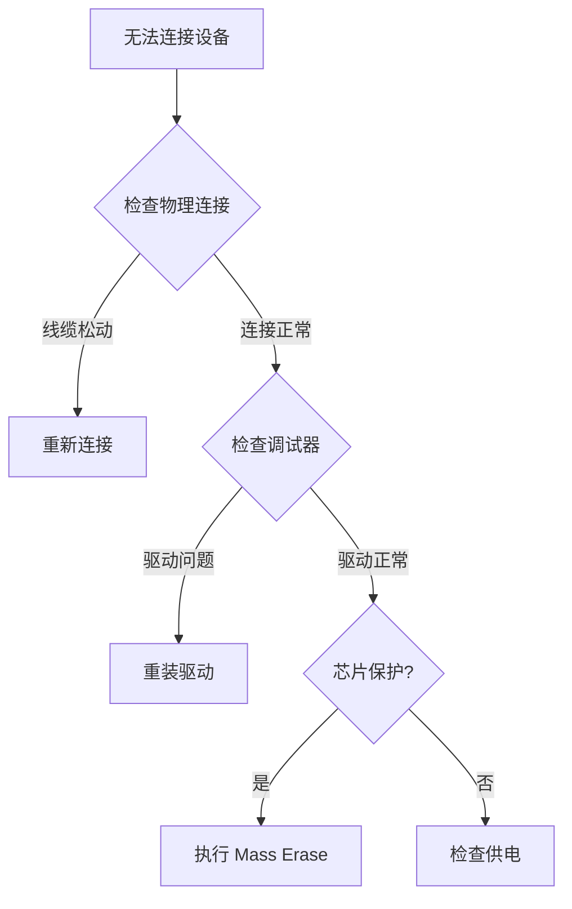

# 🔌 硬件连接与调试手册

本指南整合了硬件接线、调试器选择及芯片保护修复的完整流程。

## 1. 调试器选择

| 调试器 | 推荐指数 | 特点 | 适用场景 |
|--------|---------|------|---------|
| **J-Link** | ⭐⭐⭐⭐⭐ | 速度快、稳定性高 | 专业用户/批量生产 |
| **ST-Link V2** | ⭐⭐⭐⭐ | 性价比高、易获取 | 日常开发 |
| **DAPLink** | ⭐⭐⭐ | 开源、免驱 | 特殊需求 |

---

## 2. 标准 SWD 接线

所有 nRF5 芯片都使用 4 线 SWD 接口：

```
调试器          nRF 芯片
------         --------
SWDIO   -->    SWDIO
SWCLK   -->    SWCLK
GND     -->    GND
3.3V    -->    VCC (可选)
```

> ⚠️ **重要**: GND 必须连接！否则会导致连接不稳定。

---

## 3. 常见模块接线图

### 3.1 圆形防丢器（通用型号）

**常见芯片**: nRF51822/52832  
**焊盘定义**（从上至下）：

1. **CLK** (SWCLK)
2. **DIO** (SWDIO)
3. **VCC** (3.3V)
4. **GND**

### 3.2 绿色迷你模块（SMD 封装）

**常见芯片**: nRF52832/52810/52811  
**引脚标注**：

- **GND**: 顶部接地焊盘
- **VCC**: 3.3V 电源输入
- **CLK**: SWCLK
- **DIO**: SWDIO

### 3.3 黑色圆形防丢器（超薄型）

**常见芯片**: nRF52832  
**测试点**：

- **DIO**: 右侧靠上
- **CLK**: 右侧靠下
- **GND/VCC**: 从电池座引出

### 3.4 绿色长条模块（邮票孔）

**常见芯片**: nRF51822  
**右侧焊盘**（从上至下）：

- **GND**
- **CLK** (SWCLK)
- **DIO** (SWDIO)
- **VCC** (3.3V)

### 3.5 Unice 水滴形 (GS1-P2)

**芯片型号**: nRF52832  
**焊盘定义**（从左向右）：

1. **GND** (方形焊盘)
2. **CLK** (SWDCLK)
3. **DIO** (SWDIO)
4. **VCC** (3.3V)

> 💡 **通用提示**: 以上接线定义对同系列芯片通用。即使模块标注的芯片型号不同（如 nRF52810 vs nRF52832），只要外形相似，接线方式通常相同。

> 📸 更多接线图参考: `../archive/17-常见开发板接线图集.md`

---

## 4. 芯片保护解除（救砖）

### 4.1 检测芯片保护

如果遇到以下报错，说明芯片被保护：

- `unable to connect to the target`
- `nRF52 device has APPROTECT enabled`
- `Programming failed`

### 4.2 方法 A: 使用 Web Studio（推荐）

Web Studio 会自动检测芯片保护并尝试 **Mass Erase**：

1. 启动 `python3 nrf5_airtag_web.py`
2. 点击"探测设备"
3. 如果显示 `Chip Protected`，点击"开始刷机"
4. 系统会自动执行 Mass Erase 解锁

### 4.3 方法 B: 使用 nrfjprog (J-Link)

```bash
# nRF52 系列
nrfjprog --recover -f nrf52

# nRF51 系列
nrfjprog --recover -f nrf51

# 验证
nrfjprog --readcode -f nrf52
```

### 4.4 方法 C: 使用 OpenOCD (ST-Link)

```bash
cd heystack-nrf5x/nrf52832/armgcc  # 或对应芯片目录
openocd -f openocd.cfg -c "init; halt; nrf5 mass_erase; reset; exit"
```

**成功标志**:

```
Info : Mass erase completed.
```

### 4.5 常见问题

**Q: Mass Erase 后设备仍无法连接？**
A:

1. 检查硬件连接
2. 更换杜邦线
3. 确认调试器供电正常

**Q: ST-Link 提示需要 CTRL-AP？**
A: 这是正常提示，`mass_erase` 命令仍然有效，忽略即可。

---

## 5. 接线禁忌

❌ **错误操作**:

- SWDIO 和 SWCLK 交叉连接
- 忘记连接 GND
- 在设备运行时热插拔调试器
- 同时连接调试器 3.3V 和电池供电（可能烧毁芯片）

✅ **正确做法**:

- 先连接 GND
- 确认引脚定义后再通电
- 使用万用表测量电压

---

## 6. 故障排查流程



---

> 相关文档:
>
> - [快速开始](../getting-started/index.md)
> - [命令行刷写工具](../manuals/cli-tool.md)
